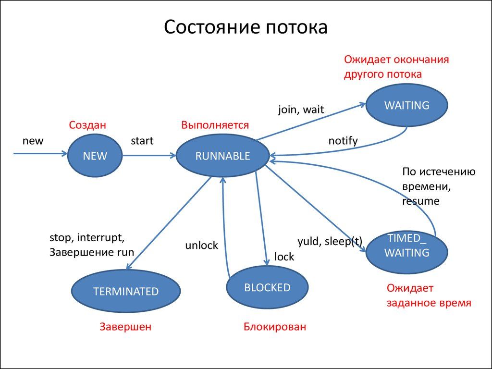

# Введение в многопоточность Java

### Процессы и потоки
**Процесс или задача (process)** – программа, находящаяся в режиме выполнения в операционной системе (ОС). Для выполнения Java-программы обычно запускается процесс работы JVM. С каждым процессом связывается его адресное пространство, внутри которого он может читать и в которое он может писать данные, поэтому процессы не влияют друг на друга в ОС. Процессы могут запускать
друг друга (взаимные запуски программ).
Поток (thread) – это подпроцесс, порождённый программой. Он выполняется в рамках и с помощью ресурсов, выделенных процессу. Эти ресурсы делятся между всеми подпроцессами.

## Основы многопоточности

Многопоточность - это способность программы выполнять несколько задач одновременно. В Java многопоточность реализуется с помощью потоков (threads).

### Что такое поток?

Поток - это легковесный процесс, который выполняется в рамках программы. Каждый поток имеет свой собственный стек вызовов, но разделяет память и ресурсы с другими потоками в рамках одного процесса.

### Преимущества использования потоков:

1. Повышение производительности программы
2. Эффективное использование ресурсов процессора
3. Упрощение разработки параллельных алгоритмов
4. Возможность выполнения нескольких задач одновременно

## Создание потоков в Java

В Java существует два основных способа создания потоков:

1. Наследование от класса `Thread`
2. Реализация интерфейса `Runnable`

### Наследование от класса Thread

```java
class MyThread extends Thread {
    public void run() {
        // Код, выполняемый в потоке
    }
}

// Использование
MyThread thread = new MyThread();
thread.start();
```

### Реализация интерфейса Runnable

```java
class MyRunnable implements Runnable {
    public void run() {
        // Код, выполняемый в потоке
    }
}

// Использование
Thread thread = new Thread(new MyRunnable());
thread.start();
```

## Жизненный цикл потока

Поток в Java может находиться в одном из следующих состояний:


1. NEW - поток создан, но еще не запущен
2. RUNNABLE - поток выполняется или готов к выполнению
3. BLOCKED - поток заблокирован и ожидает монитора
4. WAITING - поток ожидает действий другого потока
5. TIMED_WAITING - поток ожидает в течение определенного времени
6. TERMINATED - поток завершил выполнение

## Синхронизация потоков

При работе с несколькими потоками возникает необходимость в синхронизации для предотвращения проблем, связанных с одновременным доступом к общим ресурсам.

### Ключевое слово synchronized

```java
public synchronized void method() {
    // Синхронизированный метод
}

synchronized(object) {
    // Синхронизированный блок кода
}
```


### Volatile переменные

Ключевое слово `volatile` гарантирует, что изменения переменной будут видны всем потокам:

```java
private volatile boolean flag = false;
```

## Проблемы многопоточности

### Взаимная блокировка (Deadlock) [дополнительно](./deadlock.md)

Ситуация, когда два или более потока блокируют друг друга, ожидая освобождения ресурсов.

### Гонка условий (Race Condition)

Ошибка, возникающая при неправильном порядке выполнения операций в многопоточной среде.

### Активная блокировка (Livelock)

Ситуация, когда потоки постоянно реагируют на действия друг друга, не совершая полезной работы.

### Голодание потока (Thread Starvation)

Ситуация, когда поток не получает доступ к необходимым ресурсам из-за постоянного использования их другими потоками.

Многопоточность - инструмент, позволяющий создавать эффективные и отзывчивые приложения. Однако её использование требует тщательного планирования и понимания возможных проблем для создания надежных многопоточных программ.

[Потоки в Java. Habr](https://habr.com/ru/articles/776914/)

## Синхронизация потоков в Java

Синхронизация потоков необходима для предотвращения проблем, связанных с одновременным доступом к общим ресурсам в многопоточных приложениях.

### Основные механизмы синхронизации:

1. Ключевое слово `synchronized`:
   - Применяется к методам или блокам кода.
   - Обеспечивает взаимное исключение доступа к синхронизированному участку кода.
   - Гарантирует, что только один поток может выполнять определенный блок кода или метод в любой момент времени.
   - Позволяет контролировать доступ к общим ресурсам, таким как переменные или объекты, которые используются несколькими потоками.
   - Синхронизация гарантирует, что изменения, сделанные одним потоком, будут видны другим потокам, которые синхронизируются по тому же объекту.
   - Реализует механизм взаимного исключения, позволяя только одному потоку владеть монитором объекта в определенный момент времени.
   - Это предотвращает одновременное выполнение критических секций кода разными потоками.

2. Блокировки (Locks):
   - Интерфейс `Lock` и его реализации (например, `ReentrantLock`).
   - Предоставляют более гибкий контроль над синхронизацией, чем `synchronized`.

3. Volatile переменные:
   - Гарантируют, что изменения переменной будут видны всем потокам.
   - Обеспечивают атомарность операций чтения и записи.

4. Атомарные классы:
   - Классы пакета `java.util.concurrent.atomic`.
   - Предоставляют атомарные операции без использования синхронизации.

5. Методы `wait()`, `notify()` и `notifyAll()`:
   - Используются для межпоточной коммуникации.
   - Позволяют потокам ждать определенных условий и уведомлять друг друга.

### Проблемы, решаемые синхронизацией:

1. Состояние гонки (Race Condition):
   - Возникает, когда несколько потоков одновременно изменяют общие данные.

2. Взаимная блокировка (Deadlock):
   - Ситуация, когда два или более потока блокируют друг друга, ожидая освобождения ресурсов.

3. Активная блокировка (Livelock):
   - Потоки постоянно реагируют на действия друг друга, не совершая полезной работы.

4. Голодание потока (Thread Starvation):
   - Ситуация, когда поток не получает доступ к необходимым ресурсам из-за постоянного использования их другими потоками.

### Важно:

- Синхронизация может снижать производительность, поэтому её следует использовать только когда это необходимо.
- Правильное использование синхронизации требует глубокого понимания многопоточного программирования.
- Java предоставляет высокоуровневые утилиты для конкурентного программирования в пакете `java.util.concurrent`, которые часто предпочтительнее низкоуровневой синхронизации.

## Задачи для тренировки

1. Задача "Курица или яйцо":
   Создайте два класса - "Курица" и "Яйцо", наследующиеся от Thread. Каждый класс должен выводить в консоль свое название после случайной задержки (используйте Thread.sleep()). В основной программе запустите оба потока и определите, что появилось первым. Повторите эксперимент несколько раз.

2. Задача "Приоритетные потоки":
   Напишите программу, которая создает 10 потоков. Каждый поток должен вывести свой номер 1000 раз. Установите потокам приоритеты в порядке их создания (от MIN_PRIORITY до MAX_PRIORITY). Запустите программу несколько раз и проанализируйте, влияет ли приоритет на порядок выполнения потоков.

3. Задача "Синхронизированный счетчик":
   Создайте класс Counter с методом increment(), который увеличивает значение счетчика на 1. Создайте несколько потоков, которые одновременно вызывают этот метод много раз. Реализуйте синхронизацию, чтобы избежать состояния гонки. Сравните результаты работы синхронизированной и несинхронизированной версий.

4. Задача "Производитель-потребитель":
   Реализуйте классическую задачу производителя-потребителя. Создайте класс Buffer с методами put() и get(). Производитель должен генерировать числа и помещать их в буфер, а потребитель - забирать эти числа из буфера. Используйте wait() и notify() для синхронизации потоков.

5. Задача "Банковский перевод":
   Создайте класс Account с полями balance и id. Реализуйте метод transfer(Account from, Account to, int amount), который переводит деньги с одного счета на другой. Создайте несколько потоков, которые одновременно выполняют переводы между разными счетами. Используйте synchronized для предотвращения состояния гонки и избегания взаимных блокировок (deadlock).
